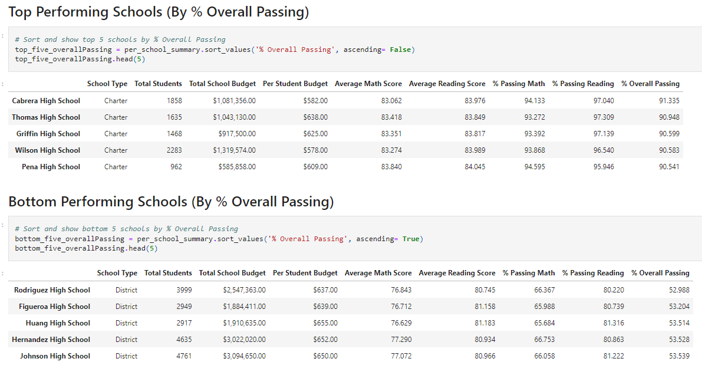
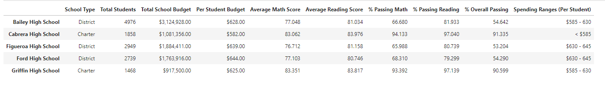
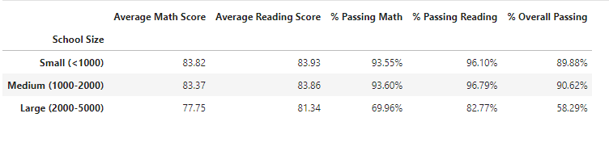
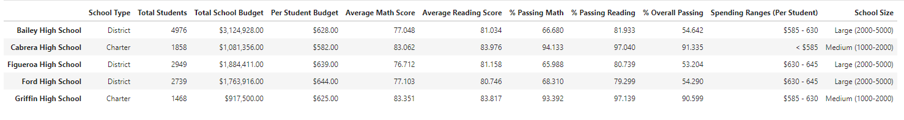

# PyCitySchools - School District Analyis 

## Context

Welcome all viewers! This week's challenge assignment is PyCitySchools where we will create dataframes to help visualize a city's school district. This data will help the school board and mayor make strategic decisions regarding future school budgets and priorities. 

## Tasks

Using Pandas and Jupyter Notebook, create a report that includes the following data. 
Also a written report of two obseravble trends based on the data. 

* Create a DataFrame for each of the following:

    * District Summary - the overall district's key metrics
    * School Summary - key metrics per school
    * Top 5 Performing Schools - schools with the highest scores based on % Overall Passing
    * Lowest 5 Performing Schools - schools with the lowest scores based on % OVerall Passing
    
    * Average Math Scores by Grade
    * Average Reading Scores by Grade
    * Scores based on average of School Spending for each student
    * Scores by School Size
    * Scores by School Type

        * Dataframes key metrics:
            * Total schools
            * Total students
            * Total budget
            * School Type
            * Average math score
            * Average reading score
            * % passing math (the percentage of students who passed math)
            * % passing reading (the percentage of students who passed reading)
            * % overall passing (the percentage of students who passed math AND reading)

## Files 

* [schools_complete.csv](PyCitySchools/Resources/students_complete.csv) -  Dataset of all students in district
* [schools_complete.csv](PyCitySchools/Resources/schools_complete.csv) - Dataset of all schools in district
* [PyCitySchools_1.ipynb](PyCitySchools/PyCitySchools_1.ipynb) - Open file with Jupyter Notebook to access
* [Images] - Folder with reference screenshots

## Summary Analysis

    In this dataset, there are 15 schools total in the district and 8 of them are charter schools. Comparing the results of top and lowest performing schools in the district, the top 5 schools with the highest overall passing percentages (96% and above) are charter schools. According to the tables, students scores are not affected by the amount of money spent on per student. Schools with the highest overall passing percentage have a lower budget of $630 or less spent on each student. Schools who have lower percentage in overall passing scores (53% or less) have a higher budget spent on each student. Schools with a budget of $630 or greater correlates schools with a larger school sizes with students 3,000 and up. 

 

    Out of 15 schools, there are a total of approximately 39,000 students attending. In reference to 'Scores by School Size' datatable, it is observed that schools with a greater student count (2000 or greater students) have scores lower in percentage of overall passing (less than 59%). Compared to schools with a lower student count, these students score higher overall in both math and reading subjects (96%). Charter schools commonly have a lower student count for 2000 students or less. In conclusion, in this school district, charter schools with a smaller school size will score higher overall. 

